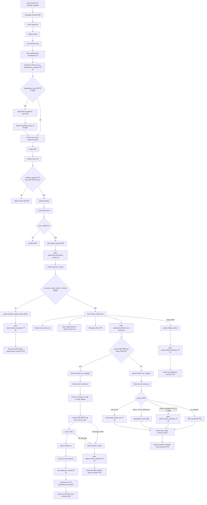

# Issue Automation Workflow Flow

이 문서는 공용 issue automation workflow의 현재 실행 흐름과 각 단계의 입출력 파일을 정의합니다.

## Flow Diagram

## Runtime Files

- `.github/issue-automation.yml`: caller repository별 classification, dependency routing, runtime path 설정
- `.github/ai/issue-agent-contract.md`: Claude Code agent가 따라야 하는 repository별 처리 계약
- `.github/ai/runtime/issue-context.md`: `phase=prepare`가 생성하고 Claude Code Action이 읽는 issue context
- `.github/ai/runtime/runner-result.json`: Claude Code Action이 쓰고 `prepare_pr_metadata`, `finalize_pr`, `finalize_no_changes`가 읽는 결과 JSON
- Runtime 파일은 repository 변경 감지와 commit 대상에서 제외합니다.

## Phase Responsibilities

| Phase | 주요 책임 | 주요 입력 | 주요 출력 |
| --- | --- | --- | --- |
| `intake` | issue state 정규화, dependency issue 초기 생성 | GitHub issue, `.github/issue-automation.yml` | state comment, dependency issue |
| `prepare` | Claude runner 실행 여부 판단, runtime context 생성 | GitHub issue, config, agent contract path | action outputs, `issue-context.md` |
| `prepare_pr_metadata` | PR 제목/본문/커밋 메시지 생성 | GitHub issue, `runner-result.json` | `commit_message`, `pr_title`, `pr_body` outputs |
| `finalize_pr` | PR 생성 이후 issue 상태 정리 | GitHub issue, PR URL, `runner-result.json` | state comment, result comment, dependency issue |
| `finalize_no_changes` | repository 변경이 없을 때 action별 후처리 | GitHub issue, `runner-result.json` | state comment, result comment, dependency issue |
| `finalize_failure` | Claude 실행 실패 처리 | GitHub issue | state comment, failure comment |
| `finalize_claude_action_failure` | Claude token 미설정 등 실행 준비 실패 처리 | GitHub issue, failure reason | state comment, failure comment |

## Dependency Issue Rules

- Dependency issue 생성 대상은 `.github/issue-automation.yml`의 `dependencies[]`로 정의합니다.
- `dependencies[].key`는 `runner-result.json`의 `needsIssues[]` 값과 일치해야 합니다.
- `dependencies[].auto_create`가 `true`이고 pattern이 title/body에 매칭되면 intake 단계에서 dependency issue 생성을 시도합니다.
- Parent issue comment 전체 페이지에 `dependencies[].marker`가 있으면 같은 dependency issue를 중복 생성하지 않습니다.
- Dependency issue 생성 후 parent issue에 GitHub sub-issue 관계 연결을 시도합니다.
- Dependency issue 생성 실패 시 parent issue에 실패 comment를 남기고 state status를 `needs_maintainer`로 저장합니다.

## Runner Execution Rules

- `issues` event에서는 issue 작성자의 `author_association`이 `OWNER`, `MEMBER`, `COLLABORATOR` 중 하나일 때만 Claude runner job을 실행합니다.
- `workflow_dispatch`는 maintainer가 수동으로 실행하는 경로로 간주해 Claude runner job을 실행할 수 있습니다.
- Claude runner 이후 변경 감지, PR metadata 생성, commit, push, PR 생성 단계가 실패하면 `phase=finalize_failure`로 parent issue state status를 `needs_maintainer`로 저장합니다.
